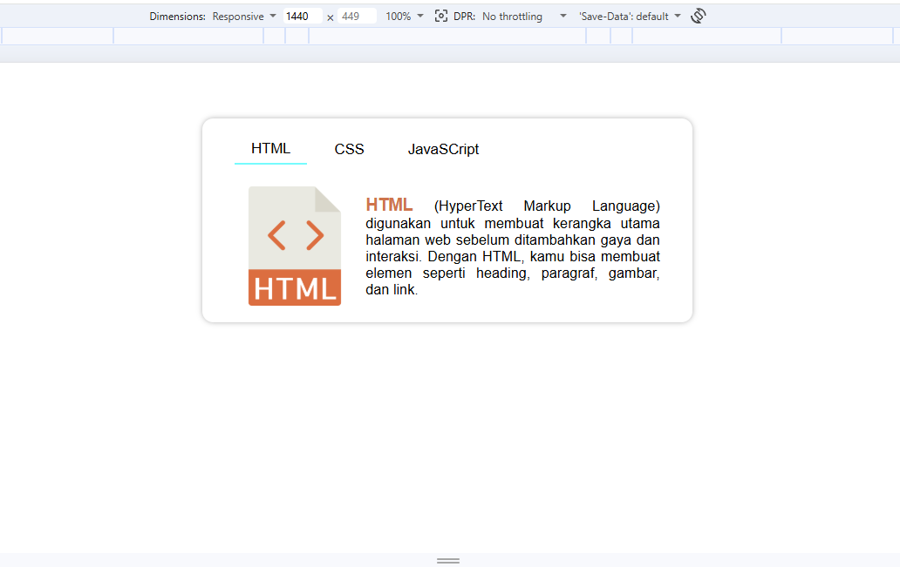

# Tabs Component (Vanilla JavaScript)

A simple and interactive tabs component built using HTML, CSS, and JavaScript.
This project demonstrates how to switch content dynamically based on user interaction.

---

## 🖼️ Preview



---

## 📌 Features

- Switch between tabs using buttons
- Dynamic content rendering using `data-*` attributes
- Active state management for buttons and content
- Smooth fade animation
- Clean and scalable structure

---

## 🧠 Concepts Learned

- DOM Selection (`querySelectorAll`)
- Event Handling (`addEventListener`)
- Dataset (`data-tab`)
- Class manipulation (`classList`)
- Difference between:
  - `opacity`
  - `visibility`
  - `display`

- `this` behavior in regular function vs arrow function
- UI state management (active tab)

---

## 🧱 HTML Structure

Each button and content is connected using `data-tab`.

```html
<div class="tabs">
  <div class="tabs-buttons">
    <button data-tab="html">HTML</button>
    <button data-tab="css">CSS</button>
    <button data-tab="js">JavaScript</button>
  </div>

  <div class="tabs-content">
    <div class="text" data-tab="html">...</div>
    <div class="text" data-tab="css">...</div>
    <div class="text" data-tab="js">...</div>
  </div>
</div>
```

---

## ⚙️ JavaScript Logic

- Add click event to each button
- Remove active class from all buttons
- Add active class to clicked button
- Match content using `data-tab`
- Toggle visibility using class

```js
const buttons = document.querySelectorAll('.tabs .tabs-buttons button');
const contents = document.querySelectorAll('.tabs .tabs-content .text');

buttons.forEach((btn) => {
  btn.addEventListener('click', function () {
    const target = this.dataset.tab;

    // Reset buttons
    buttons.forEach((b) => b.classList.remove('active'));
    this.classList.add('active');

    // Toggle content
    contents.forEach((content) => {
      content.classList.toggle('active', content.dataset.tab === target);
    });
  });
});
```

---

## 🎨 CSS Approach

### Key Idea:

Avoid layout shift and keep animation smooth.

```css
.tabs-content {
  position: relative;
}

.tabs-content .text {
  position: absolute;
  inset: 0;
  opacity: 0;
  visibility: hidden;
  transition: opacity 0.3s ease;
}

.tabs-content .text.active {
  opacity: 1;
  visibility: visible;
}
```

---

## ⚠️ Common Pitfalls

- Using `opacity` only → element still clickable
- Using `visibility` only → still takes space
- Using `position` change during animation → layout glitch
- Forgetting `max-width` for images

---

## 💡 Best Practices

- Keep default active tab in HTML
- Use `data-*` for mapping buttons and content
- Combine `opacity + visibility` for smooth transitions

---

## 🚀 Future Improvements

- Add sliding animation instead of fade
- Make component reusable
- Sync tab with URL (`?tab=html`)
- Save active tab using `localStorage`

---

## 📚 Tech Stack

- HTML5
- CSS3
- Vanilla JavaScript

---

## 🎯 Purpose

This project is built for learning fundamental frontend concepts, especially:

- DOM manipulation
- UI interaction
- Component-based thinking

---

## ✨ Author

Built as part of a frontend learning journey.
